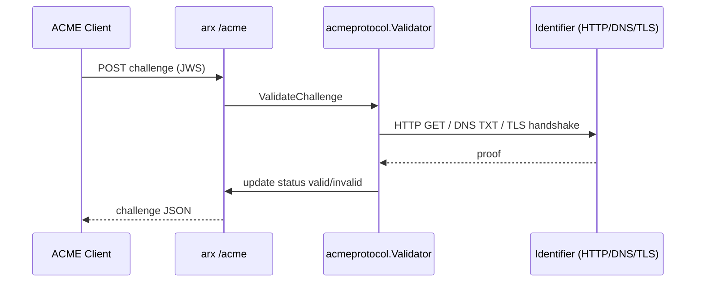

# ACME (RFC 8555)

**arx** exposes an ACMEv2 endpoint compatible with standard clients and reverse proxies. The implementation builds on [smallstep/certificates](https://github.com/smallstep/certificates) for JWS, nonce, and order flow, with **arx-specific** flat URL layout, SQLite-backed ACME state, and multi-challenge validation in `internal/acmeprotocol`.

## Enabling ACME

ACME is available when all of the following hold:

1. The step-ca configuration (`.pki/config/ca.json`) includes an **ACME provisioner** (default name: `acme`).
2. The application database is open (SQLite or PostgreSQL).
3. `CA_API_ACME_DISABLED` is not set to `true`.

On startup, when active, the server logs:

```text
ACME enabled; directory available at /acme/directory
```

Disable explicitly:

```bash
export CA_API_ACME_DISABLED=true
```

## Directory endpoint

| Item | Value |
| ---- | ----- |
| **URL path** | `/acme/directory` |
| **Mount** | Handlers are registered at `/acme/`; clients use the public path without a provisioner segment |
| **Provisioner (internal)** | `acme` — used inside step-ca routing but omitted from public URLs |

### Discovering the directory

```bash
curl -s https://ca.example.com/acme/directory | jq .
```

For a local dev server on port 8080:

```bash
curl -s http://localhost:8080/acme/directory | jq .
```

The directory JSON follows RFC 8555 (`newNonce`, `newAccount`, `newOrder`, `revokeCert`, `keyChange`, `meta`, etc.). Resource URLs for accounts, orders, authorizations, and challenges are under `/acme/account/...`, `/acme/order/...`, `/acme/authz/...`, and `/acme/challenge/...`.

### Directory URL helper

The PKI engine computes a local directory URL from the listen address:

```text
http://localhost:8080/acme/directory
```

(Scheme and host follow `CA_API_ACME_DNS`, `ca.json` DNS names, or the request `Host` header via `FlatLinker`.)

## URL layout

Public clients see a **flat** tree (no `/acme/acme/...` provisioner prefix):

| Resource | Path pattern |
| -------- | ------------ |
| Directory | `/acme/directory` |
| New nonce | `/acme/new-nonce` |
| New account | `/acme/new-account` |
| New order | `/acme/new-order` |
| Account | `/acme/account/{id}` |
| Order | `/acme/order/{id}` |
| Authorization | `/acme/authz/{id}` |
| Challenge | `/acme/challenge/{authzID}/{challengeID}` |
| Certificate | `/acme/certificate/{id}` |

`internal/acmeprotocol/linker.go` implements `FlatLinker` to generate these links. Incoming requests are adapted to step-ca’s internal provisioner-scoped paths in `pathAdapter` (`router.go`).

## Supported challenge types

All three mainstream domain-validation challenges are validated by arx before an authorization is marked valid:

| Type | RFC | Validation behavior |
| ---- | --- | --------------------- |
| **http-01** | RFC 8555 §8.3 | Outbound HTTP GET to `http://<host>/.well-known/acme-challenge/<token>`; body must equal key authorization |
| **dns-01** | RFC 8555 §8.4 | TXT lookup at `_acme-challenge.<domain>`; record must match SHA-256 digest of key authorization (base64url) |
| **tls-alpn-01** | RFC 8737 | TLS to port 443 (or configured port) with ALPN `acme-tls/1`; self-signed cert must contain critical `id-pe-acmeIdentifier` extension with SHA-256(keyAuthorization) |

Implementation files:

- `internal/acmeprotocol/http01.go` — `VerifyHTTP01`
- `internal/acmeprotocol/dns01.go` — `VerifyDNS01`
- `internal/acmeprotocol/tlsalpn01.go` — `VerifyTLSALPN01`
- `internal/acmeprotocol/validate.go` — state transitions `pending` → `processing` → `valid` | `invalid`

Wildcard identifiers use DNS-01 (per RFC); HTTP-01 and TLS-ALPN-01 apply to non-wildcard hostnames and IPs as usual.

### When to use each challenge

| Challenge | Best for | Requirements |
| --------- | -------- | -------------- |
| **HTTP-01** | Single servers, reverse proxies, Traefik/Caddy HTTP routers | Port **80** reachable from the CA for the identifier (or `CA_API_ACME_HTTP_PORT` in lab setups); place token at `/.well-known/acme-challenge/<token>` |
| **DNS-01** | Wildcards, internal names, multi-host, CDN frontends | Create `_acme-challenge.<name>` TXT record; no inbound HTTP to the origin required |
| **TLS-ALPN-01** | TLS termination on 443 without HTTP-01 path | Port **443** (or `CA_API_ACME_TLS_PORT`) serves temporary ALPN certificate during validation |

### HTTP-01 details

- Request URL: `http://<identifier>/.well-known/acme-challenge/<token>` (IPv6 addresses bracketed in URLs).
- For development, set `CA_API_ACME_HTTP_PORT` so the CA connects to a non-80 port (for example when the API listens on 8080 and a proxy maps challenge traffic).

### DNS-01 details

- TXT name: `_acme-challenge.<apex>` (wildcard auth strips `*.` for the label).
- Expected value: `DNS01Digest(keyAuthorization)` from `internal/acmeprotocol/keyauth.go`.

### TLS-ALPN-01 details

- Dial `tcp` to identifier port 443 (default) or `CA_API_ACME_TLS_PORT`.
- ALPN protocol must be `acme-tls/1`.
- Leaf certificate must match the identifier (single DNS name or single IP) and include the critical ACME identifier extension.

## Challenge validation flow



Clients trigger validation by posting to the challenge URL (RFC 8555). arx performs **outbound** checks from the CA process (not in-band hook callbacks).

## Persistence

ACME accounts, orders, authorizations, challenges, and nonces are stored in the **application database** (SQLite `arx.db` by default), not in Badger. Schema is created in `internal/database/migrate.go` (`acme_*` tables). `internal/database/acme_store.go` implements the step-ca `acme.DB` interface.

## Environment variables

| Variable | Effect |
| -------- | ------ |
| `CA_API_ACME_DISABLED` | `true` disables ACME handler registration |
| `CA_API_ACME_DNS` | Hostname used in directory links when not inferable from request/`ca.json` |
| `CA_API_ACME_HTTP_PORT` | Port for outbound HTTP-01 checks (default 80) |
| `CA_API_ACME_TLS_PORT` | Port for outbound TLS-ALPN-01 checks (default 443) |
| `CA_API_ACME_STRICT_FQDN` | `true` enables strict FQDN checks (step-ca behavior) |
| `CA_API_ACME_REQUIRE_EAB` | `true` requires External Account Binding for new accounts |
| `CA_API_ACME_DEVICE_ATTEST` | `true` enables device-attest provisioner options |
| `CA_API_ACME_ATTESTATION_FORMATS` | Comma-separated attestation formats |
| `CA_API_ACME_ATTESTATION_ROOTS` | Path to attestation trust roots |

Admin API (JWT required):

| Method | Path | Description |
| ------ | ---- | ----------- |
| `GET` | `/api/v1/acme/status` | ACME enrollment status |
| `POST` | `/api/v1/acme/eab-keys` | Create EAB keys (when EAB is used) |

## Reverse-proxy integration

### Traefik

Use the built-in ACME resolver with your arx directory URL:

```yaml
certificatesResolvers:
  arx:
    acme:
      email: admin@example.com
      storage: /path/to/acme.json
      caServer: https://ca.example.com/acme/directory
      httpChallenge:
        entryPoint: web
```

For DNS-01, configure Traefik’s DNS provider; arx still validates the TXT record at `_acme-challenge.<domain>`.

Ensure challenge traffic reaches the host the CA can query:

- **HTTP-01:** Port 80 on the identifier resolves to a listener that serves the challenge token (or set `CA_API_ACME_HTTP_PORT` consistently in dev).
- **TLS-ALPN-01:** Port 443 terminates TLS with ALPN support on the target.

### Caddy

```caddyfile
{
  acme_ca https://ca.example.com/acme/directory
}
```

Or per-site:

```caddyfile
example.com {
  tls {
    issuer acme {
      dir https://ca.example.com/acme/directory
    }
  }
}
```
```

Caddy selects challenge types automatically; use DNS challenge plugin configuration for wildcards.

### Certbot

```bash
certbot certonly \
  --server https://ca.example.com/acme/directory \
  -d www.example.com \
  --standalone   # http-01 when 80 is available to certbot
```

For DNS-01, use a Certbot DNS plugin and ensure TXT records match arx validation timing.

### Private CA / TLS trust

Clients must trust your arx **root** (and often intermediate) CA. Distribute PEMs from:

```bash
curl -s https://ca.example.com/api/v1/ca/root
curl -s https://ca.example.com/api/v1/public/ca/intermediate
```

Or install locally:

```bash
arx agent trust install-root --url https://ca.example.com
arx agent trust install-intermediate --url https://ca.example.com
```

## Operational notes

1. **Reachability** — The CA validates challenges by connecting **to** the identifier from the server process. NAT, firewalls, or wrong DNS are the most common failure modes.
2. **Directory hostname** — Set `CA_API_ACME_DNS` to the public hostname clients use (not an internal bind address).
3. **Rate limits** — Follow step-ca / arx logs for authorization and validation errors; failed challenges return to `pending` or `invalid` per error type.
4. **EAB** — When `CA_API_ACME_REQUIRE_EAB=true`, create binding keys via `POST /api/v1/acme/eab-keys` before `newAccount`.

## See also

- [architecture.md](architecture.md) — ACME component placement and databases
- [cli_reference.md](cli_reference.md) — trust installation and admin tools
- [README.md](../README.md) — quick start and health checks
