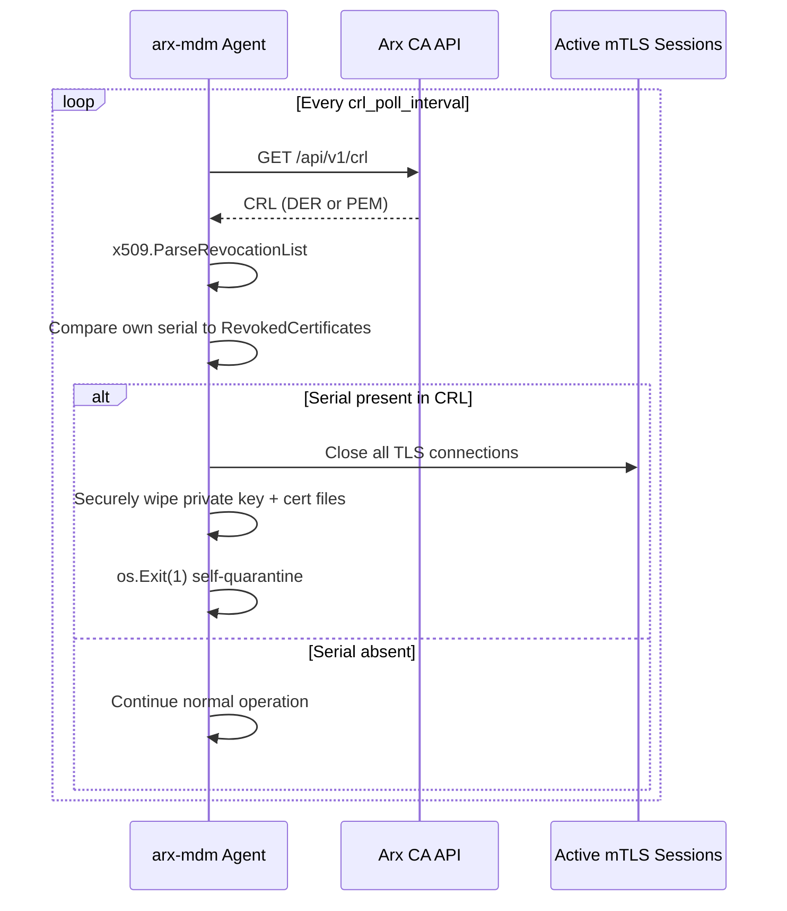

# arx-mdm Agent CRL Polling Architecture

This document specifies how the **arx-mdm** management agent autonomously verifies its own
client certificate status against the Arx CA Certificate Revocation List (CRL). The pattern
applies to any long-lived endpoint agent that maintains mutual TLS (mTLS) sessions to the CA
or to CA-proxied control-plane services.

## Goals

| Goal | Rationale |
| ---- | --------- |
| Detect passive revocation | Administrators may revoke a compromised agent certificate without contacting the endpoint |
| Fail closed | A revoked agent must stop operating immediately and remove key material |
| Low CA load | Poll interval is hours, aligned with CRL `Cache-Control: max-age=3600` |
| Offline tolerance | Agent continues with the last known-good CRL until the next successful fetch |

## CA CRL Endpoint

| Property | Value |
| -------- | ----- |
| Method | `GET` |
| Path | `/api/v1/crl` (alias: `/api/v1/ca/crl`) |
| Authentication | None (public CRL distribution) |
| Default format | DER (`Content-Type: application/pkix-crl`) |
| PEM format | Append query flag `?pem` |
| Cache hint | `Cache-Control: public, max-age=3600` |

Example fetch (DER):

```http
GET /api/v1/crl HTTP/1.1
Host: ca.example.com
Accept: application/pkix-crl
```

Example fetch (PEM):

```http
GET /api/v1/crl?pem HTTP/1.1
Host: ca.example.com
Accept: application/x-pem-file
```

The agent SHOULD honor `Cache-Control` and MUST NOT poll more frequently than once per hour
unless an operator override (`crl_poll_interval`) is explicitly set below that minimum.

## High-Level Flow



## Agent Configuration

Recommended `agent.yaml` extension (arx-mdm profile):

```yaml
crl:
  enabled: true
  ca_base_url: https://ca.example.com
  poll_interval: 6h
  format: der          # der | pem
  fail_on_fetch_error: false
```

| Field | Default | Description |
| ----- | ------- | ----------- |
| `crl.enabled` | `true` | Enable background CRL polling goroutine |
| `crl.ca_base_url` | — | Base URL of the Arx CA API (no trailing slash) |
| `crl.poll_interval` | `6h` | Ticker interval between CRL fetches |
| `crl.format` | `der` | Request DER or PEM (`?pem`) encoding |
| `crl.fail_on_fetch_error` | `false` | When `false`, retain last CRL on transient network errors |

Environment overrides use the `ARX_MDM_` prefix (for example
`ARX_MDM_CRL_POLL_INTERVAL=12h`).

## Background Goroutine (Ticker)

The agent starts a dedicated goroutine at process boot, before accepting new mTLS
connections:

```go
func (a *Agent) runCRLPoller(ctx context.Context) {
    interval := a.cfg.CRL.PollInterval
    if interval < time.Hour {
        interval = time.Hour
    }

    ticker := time.NewTicker(interval)
    defer ticker.Stop()

    for {
        select {
        case <-ctx.Done():
            return
        case <-ticker.C:
            a.evaluateCRL(ctx)
        }
    }
}
```

`evaluateCRL` performs the HTTP fetch, parses the CRL, and invokes self-quarantine when the
agent's own certificate serial appears in `RevokedCertificates`.

## CRL Fetch and Parse

### HTTP Client

- Use a dedicated `http.Client` with timeouts (`Dial`, `TLSHandshake`, `ResponseHeader`).
- TLS verification MUST use the CA trust anchor installed during enrollment (root +
  intermediate chain).
- Do not reuse the mTLS client certificate for CRL fetch; the CRL endpoint is unauthenticated.

### Parsing with `crypto/x509`

```go
func parseCRL(raw []byte, pemEncoded bool) (*x509.RevocationList, error) {
    der := raw
    if pemEncoded {
        block, _ := pem.Decode(raw)
        if block == nil || block.Type != "X509 CRL" {
            return nil, errors.New("invalid PEM CRL")
        }
        der = block.Bytes
    }
    return x509.ParseRevocationList(der)
}
```

### Serial Number Comparison

The agent loads its operational client certificate at startup and caches
`cert.SerialNumber` (`*big.Int`). For each entry in `crl.RevokedCertificates`, compare with
`serial.Cmp(entry.SerialNumber) == 0`.

Serial numbers MUST be compared numerically, not as formatted hex strings, because the CA may
emit decimal strings in API metadata while CRL entries use ASN.1 INTEGER encoding.

## Self-Quarantine Procedure

When the agent's serial is present in the CRL, execute the following steps in order:

1. **Log** a single structured error event (`crl_self_revoked`) with the revocation time and
   reason code from the matching `x509.RevocationListEntry` when available.
2. **Sever mTLS** — close every active `*tls.Conn` / `http.Transport` idle connection and
   cancel in-flight requests tied to the agent identity.
3. **Wipe key material** — overwrite private key bytes in memory (where feasible), delete
   on-disk key and certificate files configured for the agent identity, and zero temporary
   copies.
4. **Exit** — call `os.Exit(1)` (or equivalent fatal shutdown) so process supervisors
   (systemd, Kubernetes, MDM) mark the endpoint as unhealthy and block automatic restart until
   re-enrollment.

The agent MUST NOT attempt automatic re-enrollment after self-quarantine; remediation is an
explicit operator action.

## Error Handling

| Condition | Behavior |
| --------- | -------- |
| HTTP 4xx/5xx on CRL fetch | Log warning; retain previous CRL if `fail_on_fetch_error: false` |
| Parse failure | Log error; treat as fetch failure |
| First fetch fails (no cached CRL) | Continue operating but re-attempt on next tick; emit metric `crl_fetch_failed` |
| Serial match | Immediate self-quarantine (no retry) |

## Observability

Export the following telemetry (OpenTelemetry metrics and structured logs):

| Signal | Name | Description |
| ------ | ---- | ----------- |
| Counter | `arx_mdm_crl_poll_total` | CRL poll attempts |
| Counter | `arx_mdm_crl_poll_errors_total` | Failed polls |
| Gauge | `arx_mdm_crl_next_update_unix` | Parsed `crl.NextUpdate` timestamp |
| Event | `crl_self_revoked` | Emitted once before exit when serial is listed |

## Security Considerations

- **Clock skew:** Compare `crl.ThisUpdate` / `NextUpdate` against system UTC; reject CRLs that
  are not yet valid or are expired beyond a configured grace window.
- **TOCTOU:** Polling is eventually consistent. High-security deployments SHOULD combine CRL
  polling with OCSP stapling or direct OCSP queries for time-sensitive revocations.
- **Transport:** Always fetch CRL over TLS with hostname verification against the CA API
  certificate.
- **Key wipe:** Use platform-specific secure delete where available; at minimum, unlink key
  files and overwrite buffers before exit.

## Relationship to arx-agent

| Component | Role |
| --------- | ---- |
| `arx-agent` | Certificate renewal daemon (`agent.yaml`, API/ACME protocols) |
| `arx-mdm` | Endpoint management agent with persistent mTLS control channel |

Both agents share enrollment trust material under `~/.arx-cert-service/`, but only **arx-mdm**
implements the CRL self-quarantine loop described here. Future arx-mdm implementations MUST
embed this goroutine in the main `run` command lifecycle and honor the configuration keys
above.

## References

- [API reference — GET /api/v1/crl](api_reference.md)
- [Agent configuration](agent.md)
- Go `crypto/x509` — [`ParseRevocationList`](https://pkg.go.dev/crypto/x509#ParseRevocationList)
