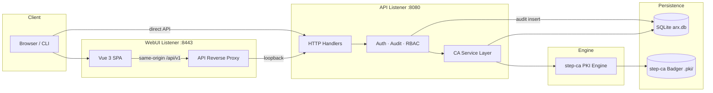
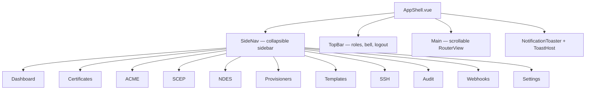

# Architecture

## Design goals

- Single static binary, embedded SQLite, no external DB required
- step-ca as signing engine; arx as control plane
- Thin HTTP handlers → services → repositories
- Stateless REST API with `{ "data", "error" }` envelope

## Component diagram

## Dual-listener model

| Listener | Default | Serves |
| -------- | ------- | ------ |
| API | `:8080` | `/api/v1/*`, `/acme/`, `/ocsp`, `/scep/`, `/certsrv/` |
| WebUI | `:8443` | Static SPA + optional loopback proxy (`webui.proxy_api`) |

- `webui.proxy_api: true` (default) — browser calls same-origin `/api/v1` on the WebUI port
- Vite dev (`:5173`) proxies `/api` to the API listener during development

## Vue / Go split

### Frontend (`webui/`)

| Layer | Technology |
| ----- | ---------- |
| Framework | Vue 3 + TypeScript |
| Router | Vue Router (`createWebHistory`) |
| State | Pinia (`auth` store) |
| HTTP | Axios → `{origin}/api/v1` |
| Styling | Tailwind + `theme.css` design tokens |

### Backend (`internal/`)

| Package | Responsibility |
| ------- | -------------- |
| `internal/cmd/arx` | Cobra CLI, route registration |
| `internal/api/handlers` | REST endpoints |
| `internal/api/middleware` | Audit, JWT, API-key, RBAC |
| `internal/ca` | step-ca wrapper, provisioners |
| `internal/database` | SQL migrations, cert archive |
| `internal/db` | Audit, webhooks, notifications, SSH certs |
| `internal/notifications` | SSE broadcast + webhook dispatcher |
| `internal/server` | Dedicated WebUI static server |

## App Shell layout

| Chrome element | Behavior |
| -------------- | -------- |
| Sidebar | Collapsible (`w-52` ↔ `w-14`); preference in `localStorage` |
| Mobile | Hamburger drawer + backdrop below `md` breakpoint |
| Top bar | Role badges, notification bell, logout |
| Main | Only scrollable region (`overflow-y-auto`) |
| SSE | `useNotifications` connects on auth mount |

## SQLite schema (`arx.db`)

### Application tables (`internal/database`)

| Table | Purpose |
| ----- | ------- |
| `users` | Admin accounts (`id`, `email`, `password_hash`, `role`) |
| `issued_certificates` | X.509 archive with optional key escrow |
| `acme_*` | ACME accounts, orders, authorizations, challenges, EAB keys |

**`issued_certificates` columns:**

| Column | Type | Notes |
| ------ | ---- | ----- |
| `serial` | TEXT PK | Certificate serial |
| `common_name` | TEXT | Subject CN |
| `subject` | TEXT | Full DN |
| `certificate_pem` | TEXT | PEM body |
| `encrypted_private_key` | BLOB | AES-256-GCM escrow (optional) |
| `not_before` / `not_after` | TEXT | Validity window |
| `requestor_id` | TEXT | Issuing actor |
| `status` | TEXT | `ACTIVE` \| `REVOKED` |
| `revoked_at` | TEXT | Revocation timestamp |
| `reason_code` | INTEGER | RFC 5280 reason |
| `revocation_reason` | TEXT | Human label |

### Forensic / notification tables (`internal/db`)

| Table | Purpose |
| ----- | ------- |
| `audit_logs` | Append-only forensic trail |
| `webhooks` | Outbound endpoint config |
| `notifications` | Operator notification history |
| `ssh_certificates` | SSH cert inventory metadata |

**`audit_logs` columns:**

| Column | Type |
| ------ | ---- |
| `id` | TEXT PK |
| `timestamp` | TEXT (RFC3339Nano) |
| `request_id` | TEXT |
| `ip_address` | TEXT |
| `http_method` | TEXT |
| `endpoint` | TEXT |
| `status_code` | INTEGER |
| `actor_type` / `actor_id` | TEXT |
| `actor_roles` | TEXT (JSON array) |
| `action` | TEXT |
| `provisioner` | TEXT (nullable) |
| `fingerprint` | TEXT (nullable) |
| `metadata` | TEXT (JSON object) |

**`ssh_certificates` columns:**

| Column | Type |
| ------ | ---- |
| `id` | TEXT PK |
| `serial` | TEXT |
| `cert_type` | TEXT (`user` \| `host`) |
| `principals` | TEXT |
| `fingerprint` | TEXT |
| `valid_after` / `valid_before` | TEXT |

## step-ca storage (`.pki/`)

| Path | Contents |
| ---- | -------- |
| `config/ca.json` | Provisioners, claims, ACME config |
| `secrets/` | CA keys, SSH CA keys |
| Badger DB | step-ca issued-certificate index |

## Security model (RBAC)

| Role | Credential |
| ---- | ---------- |
| Admin | JWT from `POST /api/v1/auth/login` |
| Service account | `X-API-Key` or Bearer API key |
| ACME client | Account key JWS |
| mTLS client | Valid CA-issued client cert |

| Capability | Roles |
| ---------- | ----- |
| `certificates:issue` | SuperAdmin, CA-Admin |
| `certificates:revoke` | SuperAdmin, Revocation-Manager |
| `certificates:read` | SuperAdmin, CA-Admin, Revocation-Manager, Read-Only |
| `webhooks:manage` | SuperAdmin, CA-Admin |
| `audit:read` | SuperAdmin, CA-Admin, Revocation-Manager, Read-Only |
