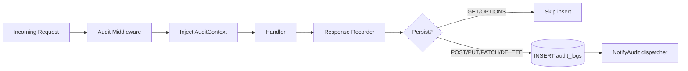

# Audit Log

## Purpose

- Append-only forensic trail of state-changing API operations
- Captures actor identity, network context, and business metadata
- Feeds webhook dispatcher and operator notification engine
- Queryable via REST API and WebUI (`/audit`)

## Capture flow



## Skipped methods

| Method | Persisted? |
| ------ | ---------- |
| `GET` | **No** |
| `OPTIONS` | **No** |
| `POST` | Yes |
| `PUT` | Yes |
| `PATCH` | Yes |
| `DELETE` | Yes |

- Read-only traffic is intentionally excluded to reduce noise
- Forensic reads (`GET /api/v1/audit`) are themselves not audited

## Skipped paths

| Path | Reason |
| ---- | ------ |
| `/api/v1/health` | High-frequency probe |
| `/api/v1/notifications/stream` | Long-lived SSE connection |

## Canonical audit actions

| Action | Trigger |
| ------ | ------- |
| `SYS_START` | Server process start |
| `SYS_CONFIG_UPDATE` | Configuration change |
| `AUTH_LOGIN_SUCCESS` | Successful admin login |
| `AUTH_LOGIN_FAILED` | Failed login attempt |
| `CERT_ISSUE_NATIVE` | Key + cert generated |
| `CERT_ISSUE_CSR` | CSR signed |
| `CERT_REVOKE` | Certificate revoked |
| `CERT_RENEW` | Certificate renewed |
| `EAB_GENERATE` | ACME EAB key created |
| `EAB_REVOKE` | ACME EAB key revoked |
| `SCEP_CHALLENGE_ROTATED` | SCEP challenge rotated |
| `SSH_USER_CERT_ISSUE` | SSH user cert issued |
| `SSH_HOST_CERT_ISSUE` | SSH host cert issued |
| `WEBHOOK_CREATED` | Webhook registered |
| `WEBHOOK_UPDATED` | Webhook modified |
| `WEBHOOK_DELETED` | Webhook removed |
| `HTTP_WRITE` | Unlabeled `POST` fallback |
| `HTTP_UPDATE` | Unlabeled `PUT`/`PATCH` fallback |
| `HTTP_DELETE` | Unlabeled `DELETE` fallback |

- Handlers set explicit actions via `AuditContext.SetAction()`
- Unlabeled mutating requests receive `HTTP_*` fallback actions

## Record schema

| Field | Source |
| ----- | ------ |
| `id` | UUID (auto-generated) |
| `timestamp` | Request start time (UTC) |
| `request_id` | UUID → `X-Request-ID` response header |
| `ip_address` | `X-Forwarded-For` → `X-Real-IP` → `RemoteAddr` |
| `http_method` | Request method |
| `endpoint` | URL path |
| `status_code` | HTTP response status |
| `actor_type` | `User`, `ServiceAccount`, `System` |
| `actor_id` | Email, account ID, CN, or `anonymous` |
| `actor_roles` | JSON array of RBAC role names |
| `action` | Business action identifier |
| `provisioner` | CA provisioner (when applicable) |
| `fingerprint` | SHA-256 hex of X.509 cert |
| `metadata` | JSON object (handler-enriched) |

### Common metadata keys

| Key | Context |
| --- | ------- |
| `user_agent` | Always captured |
| `serial` | Certificate operations |
| `principals` | SSH user certs |
| `webhook_name` | Webhook CRUD |

## Actor resolution priority

1. Handler override (`AuditContext.SetActor`)
2. Admin JWT username from context
3. Service account from API key context
4. mTLS client CN
5. Fallback: `System` / `anonymous`

## Query API

`GET /api/v1/audit`

| Param | Default | Max | Description |
| ----- | ------- | --- | ----------- |
| `limit` | 50 | 500 | Page size |
| `offset` | 0 | — | Skip rows |
| `action` | — | — | Exact action match |
| `actor` | — | — | Substring match on ID or type |
| `ip` | — | — | Substring match on IP |
| `status` | — | — | HTTP status code |

### Response shape

```json
{
  "error": null,
  "data": {
    "logs": [ { "id": "…", "action": "CERT_REVOKE", "…": "…" } ],
    "total": 142,
    "limit": 50,
    "offset": 0
  }
}
```

## Immutability guarantees

- `AuditStore.Insert` only — no `UPDATE` or `DELETE` methods
- Append-only `audit_logs` table
- Tamper evidence via `request_id` correlation

## WebUI forensic dashboard

- Route: `/audit`
- Features:
  - Paginated table with `DataTable` + `Pagination`
  - Column filters: action, actor, IP, status code
  - Expandable row metadata (JSON)
  - Dark-mode native styling

## Downstream consumers

| Consumer | Trigger |
| -------- | ------- |
| Webhook dispatcher | Subscribed `action` match |
| SSE broadcast | Elevated operator actions |
| `notifications` table | Elevated operator actions |
| Operator investigation | Manual `GET /api/v1/audit` queries |
