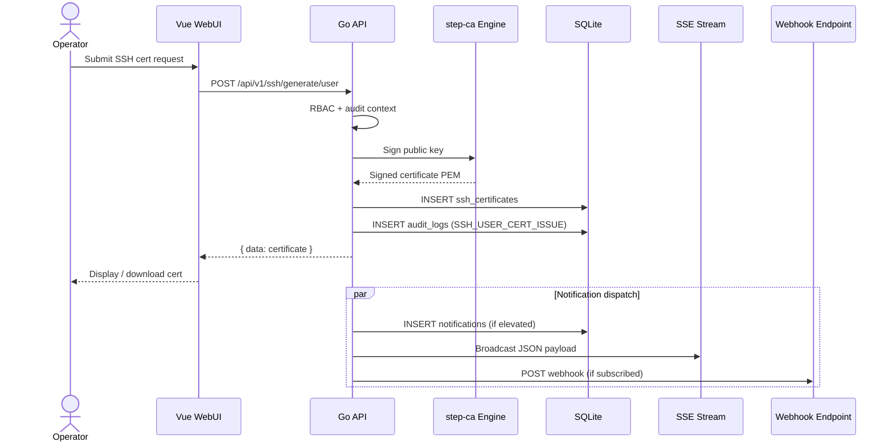

# SSH CA Setup

## Overview

- arx operates an SSH Certificate Authority via the step-ca SSH engine
- Two CA keys: **User CA** (client auth) and **Host CA** (server identity)
- Default TTL: user **4h**, host **8760h** (1 year)

## Retrieve CA public keys

### API

```bash
curl -sS https://ca.example.com/api/v1/ssh/roots | jq .
```

### WebUI

- Navigate to **SSH CA** (`/ssh`)
- Click **Download .pub** under **SSH CA Roots**

### On-disk fallback

| Key | Path |
| --- | ---- |
| User CA | `.pki/secrets/ssh_user_ca_key.pub` |
| Host CA | `.pki/secrets/ssh_host_ca_key.pub` |

## Trust user certificates on Linux servers

User certs authenticate SSH clients. Install the **User CA** on every `sshd` host.

### Step 1 — Copy CA public key

```bash
curl -sS https://ca.example.com/api/v1/ssh/roots \
  | jq -r '.data.user_keys[0].public_key' \
  | sudo tee /etc/ssh/ca.pub
sudo chmod 644 /etc/ssh/ca.pub
```

Or from a saved file:

```bash
sudo install -m 644 -o root -g root user-ca.pub /etc/ssh/ca.pub
```

### Step 2 — Configure `sshd`

```bash
sudo tee -a /etc/ssh/sshd_config <<'EOF'
TrustedUserCAKeys /etc/ssh/ca.pub
EOF
```

### Step 3 — Validate and reload

```bash
sudo sshd -t && sudo systemctl reload sshd
```

### Step 4 — Client login with signed cert

Generate a user cert via WebUI or API, then:

```bash
ssh -i ~/.ssh/id_ed25519 -i ~/.ssh/id_ed25519-cert.pub user@server.example.com
```

Or in `~/.ssh/config`:

```
IdentityFile ~/.ssh/id_ed25519
IdentityFile ~/.ssh/id_ed25519-cert.pub
```

## Trust host certificates on clients

Host certs replace per-server `known_hosts` entries.

### Step 1 — Add Host CA to `known_hosts`

```bash
mkdir -p ~/.ssh
curl -sS https://ca.example.com/api/v1/ssh/roots \
  | jq -r '.data.host_keys[0].public_key' \
  | sed 's/^/@cert-authority * /' >> ~/.ssh/known_hosts
```

Expected line format:

```
@cert-authority * ssh-ed25519 AAAAC3NzaC1lZDI1NTE5AAAAI...
```

### Step 2 — Sign server host key

- Use WebUI **Host Certificates** tab or `POST /api/v1/ssh/generate/host`
- Install signed cert on the server:

```bash
sudo install -m 644 -o root -g root ssh-host-cert.pub \
  /etc/ssh/ssh_host_ed25519_key-cert.pub
```

### Step 3 — Configure `sshd` host certificate

```bash
sudo tee -a /etc/ssh/sshd_config <<'EOF'
HostCertificate /etc/ssh/ssh_host_ed25519_key-cert.pub
EOF
sudo sshd -t && sudo systemctl reload sshd
```

## Issuance sequence diagram



## API endpoints (SSH)

| Method | Path | Auth | Action |
| ------ | ---- | ---- | ------ |
| `POST` | `/api/v1/ssh/generate/user` | Admin JWT | Generate user cert |
| `POST` | `/api/v1/ssh/generate/host` | Admin JWT | Generate host cert |
| `POST` | `/api/v1/ssh/sign-user` | Provisioner token | Sign user key |
| `POST` | `/api/v1/ssh/sign-host` | Admin JWT | Sign host key |
| `POST` | `/api/v1/ssh/inspect` | Admin JWT | Parse SSH cert |
| `GET` | `/api/v1/ssh/roots` | None | CA public keys |
| `GET` | `/api/v1/ssh/certificates` | Admin JWT | Inventory list |
| `GET` | `/api/v1/ssh/stats` | Admin JWT | Issuance statistics |

## Operational notes

- User certs include `permit-pty` and `permit-port-forwarding` extensions
- Audit actions: `SSH_USER_CERT_ISSUE`, `SSH_HOST_CERT_ISSUE`
- Webhook subscribers receive the same JSON payload as SSE clients
