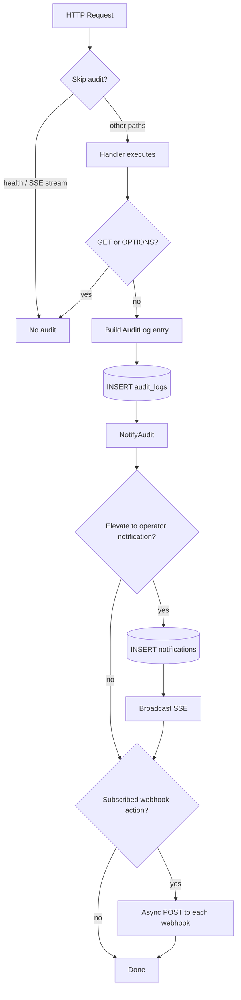

# Webhooks & Notifications

## Overview

- State-changing API requests produce immutable audit entries
- The notification dispatcher elevates selected actions to operator alerts
- Subscribed webhooks receive asynchronous `POST` deliveries
- SSE provides real-time push to the WebUI notification center

## Dispatcher flowchart



## Skipped / non-dispatched paths

| Condition | Effect |
| --------- | ------ |
| `GET /api/v1/health` | No audit record |
| `GET /api/v1/notifications/stream` | No audit record |
| `GET`, `OPTIONS` methods | No audit record (any path) |

## Subscribable webhook events

| Action | Label |
| ------ | ----- |
| `SYS_START` | System Start |
| `SYS_CONFIG_UPDATE` | Configuration Update |
| `AUTH_LOGIN_SUCCESS` | Login Success |
| `AUTH_LOGIN_FAILED` | Login Failed |
| `CERT_ISSUE_NATIVE` | Native Certificate Issuance |
| `CERT_ISSUE_CSR` | CSR Certificate Issuance |
| `CERT_REVOKE` | Certificate Revocation |
| `CERT_RENEW` | Certificate Renewal |
| `EAB_GENERATE` | EAB Key Generated |
| `EAB_REVOKE` | EAB Key Revoked |
| `SCEP_CHALLENGE_ROTATED` | SCEP Challenge Rotated |
| `SSH_USER_CERT_ISSUE` | SSH User Certificate |
| `SSH_HOST_CERT_ISSUE` | SSH Host Certificate |
| `WEBHOOK_CREATED` | Webhook Created |
| `WEBHOOK_UPDATED` | Webhook Updated |
| `WEBHOOK_DELETED` | Webhook Deleted |

## Operator notification elevation (SSE + history)

Only these actions create persistent operator notifications:

| Action | Level |
| ------ | ----- |
| `AUTH_LOGIN_FAILED` | **critical** |
| `CERT_ISSUE_NATIVE` | info |
| `CERT_ISSUE_CSR` | info |
| `CERT_REVOKE` | **critical** |
| `CERT_RENEW` | info |
| `EAB_GENERATE` | info |
| `EAB_REVOKE` | **critical** |

- All other audit events remain in `audit_logs` only
- `HTTP_*` prefixed actions are never elevated

## Webhook JSON payload

Delivered as `POST` with `Content-Type: application/json`.

| Field | Type | Description |
| ----- | ---- | ----------- |
| `notification_id` | string | Set when persisted to `notifications` |
| `timestamp` | string | RFC3339Nano UTC |
| `action` | string | Audit action identifier |
| `actor.type` | string | `User`, `ServiceAccount`, `System` |
| `actor.id` | string | Username, account ID, or CN |
| `actor.roles` | string[] | RBAC roles (when applicable) |
| `ip_address` | string | Client IP |
| `resource.provisioner` | string | CA provisioner name |
| `resource.fingerprint` | string | SHA-256 cert fingerprint (hex) |
| `metadata` | object | Handler-specific key/value pairs |
| `request_id` | string | Correlation UUID (`X-Request-ID`) |
| `http_method` | string | Original HTTP method |
| `endpoint` | string | Request path |
| `status_code` | integer | HTTP response status |

### Example payload

```json
{
  "notification_id": "a1b2c3d4-e5f6-7890-abcd-ef1234567890",
  "timestamp": "2026-06-07T14:30:00.123456789Z",
  "action": "CERT_REVOKE",
  "actor": {
    "type": "User",
    "id": "admin@example.com",
    "roles": ["SuperAdmin"]
  },
  "ip_address": "203.0.113.10",
  "resource": {
    "provisioner": "admin",
    "fingerprint": "a1b2c3d4e5f67890..."
  },
  "metadata": {
    "serial": "1234567890",
    "reason": "keyCompromise"
  },
  "request_id": "f47ac10b-58cc-4372-a567-0e02b2c3d479",
  "http_method": "POST",
  "endpoint": "/api/v1/certificates/revoke",
  "status_code": 200
}
```

## HMAC signature

- Header: `X-Webhook-Signature: sha256=<hex>`
- Algorithm: HMAC-SHA256 over the raw JSON body
- Secret: configured per webhook (`secret_token`)

## Delivery behavior

| Setting | Value |
| ------- | ----- |
| HTTP method | `POST` |
| Timeout | 5 seconds |
| Retries | 2 (500 ms backoff base) |
| User-Agent | `arx-ca-webhook/1.0` |
| Success | HTTP 2xx |

## Webhook management API

| Method | Path | Description |
| ------ | ---- | ----------- |
| `GET` | `/api/v1/webhooks/events` | List subscribable actions |
| `GET` | `/api/v1/webhooks` | List configured webhooks |
| `POST` | `/api/v1/webhooks` | Create webhook |
| `PUT` | `/api/v1/webhooks/{id}` | Update webhook |
| `DELETE` | `/api/v1/webhooks/{id}` | Delete webhook |
| `POST` | `/api/v1/webhooks/{id}/test` | Send `WEBHOOK_TEST` probe |

### Create request body

| Field | Type | Required |
| ----- | ---- | -------- |
| `url` | string | yes |
| `name` | string | yes |
| `secret_token` | string | no |
| `active` | boolean | no (default `true`) |
| `subscribed_events` | string[] | yes |

## Notification center API

| Method | Path | Description |
| ------ | ---- | ----------- |
| `GET` | `/api/v1/notifications/stream` | SSE real-time stream |
| `GET` | `/api/v1/notifications` | Paginated history |
| `POST` | `/api/v1/notifications/{id}/read` | Mark single read |
| `POST` | `/api/v1/notifications/read-all` | Mark all read |
| `POST` | `/api/v1/notifications/archive-all` | Archive all |
| `DELETE` | `/api/v1/notifications/{id}` | Delete notification |

## WebUI integration

- **Webhooks** view (`/webhooks`) — CRUD + test probe
- **TopBar bell** — SSE-driven toasts + persistent drawer
- Layout modes: `drawer` or `overlay` (`arx_ui_notification_style` in `localStorage`)
